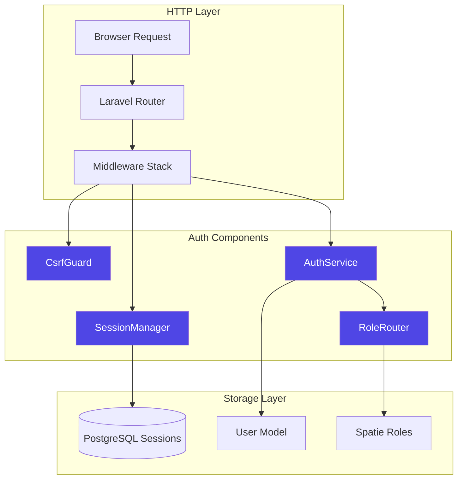
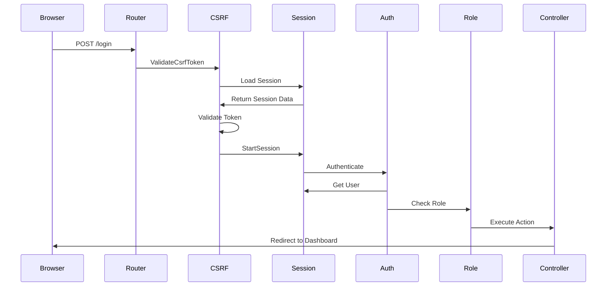
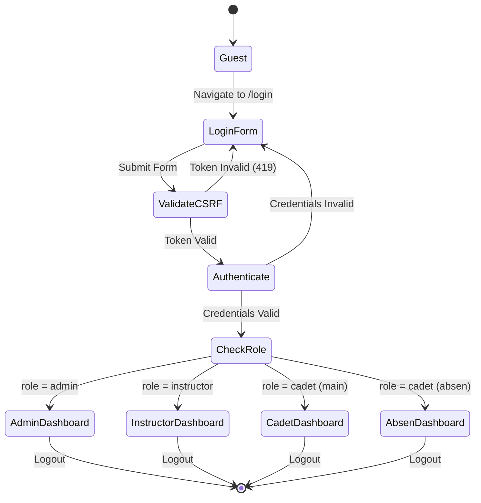
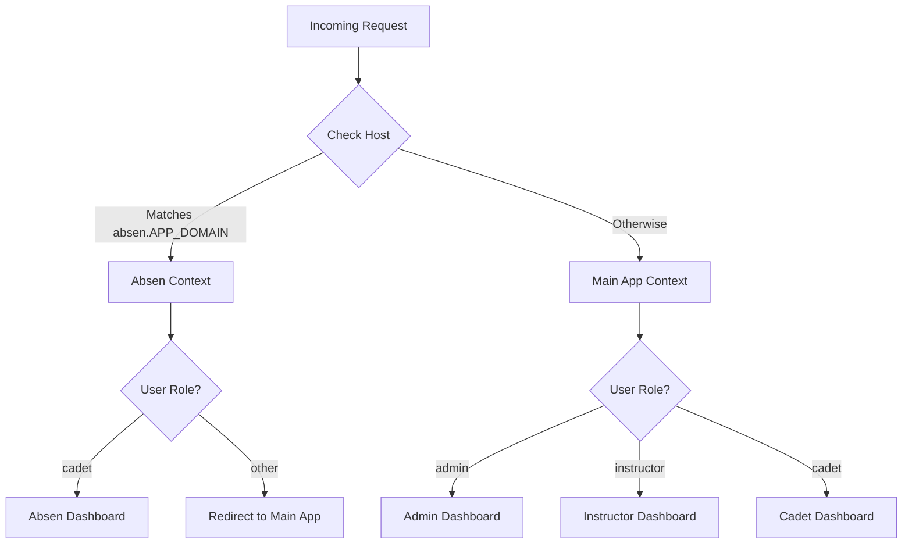

# Design Document: Clean Auth System Rebuild

## Overview

The clean auth system rebuild addresses critical authentication and session management issues in the Cadet Academy application. The current implementation suffers from persistent 419 CSRF errors, unreliable session handling, and scattered role-based routing logic across the main application (cadet-academy.test) and attendance subdomain (absen.cadet-academy.test).

This design implements a centralized authentication architecture with:
- **Database-backed session management** to ensure session persistence and scalability
- **Proper CSRF token lifecycle management** to eliminate false-positive 419 errors
- **Centralized role-based routing** that consistently directs users to appropriate dashboards
- **Subdomain-aware authentication** that handles both main and absen apps seamlessly
- **Security-hardened cookie configuration** following best practices

The rebuild replaces the current ad-hoc authentication handling (currently has CSRF globally disabled with `'*'` exclusion) with a robust, maintainable system that provides reliable authentication across both application contexts.

### Key Design Goals

1. **Eliminate 419 CSRF Errors**: Remove the temporary global CSRF bypass and implement proper token management
2. **Session Reliability**: Replace inconsistent session handling with database-backed persistence
3. **Single Source of Truth**: Centralize role detection and routing logic to eliminate duplication
4. **Subdomain Support**: Handle authentication seamlessly across main and absen subdomains
5. **Security Hardening**: Implement secure cookie configuration and proper middleware ordering

## Architecture

### System Components



### Middleware Stack Flow

The authentication system uses a carefully ordered middleware stack to ensure security and functionality:



### Authentication Flow



### Subdomain Detection Architecture

The system must differentiate between main app and absen app contexts:



## Components and Interfaces

### 1. SessionManager

**Responsibility**: Manage session lifecycle, storage, and cookie configuration

**Location**: Configuration-based (no new class, uses Laravel's built-in session manager)

**Configuration Interface** (config/session.php):
```php
return [
    'driver' => 'database',           // Database-backed storage
    'lifetime' => 120,                 // 120 minutes
    'expire_on_close' => false,
    'encrypt' => false,
    'connection' => null,              // Use default DB connection
    'table' => 'sessions',
    'cookie' => 'cadet_academy_session',
    'path' => '/',
    'domain' => null,                  // No wildcard domain
    'secure' => env('SESSION_SECURE_COOKIE', false),
    'http_only' => true,               // Prevent XSS
    'same_site' => 'lax',              // CSRF protection
];
```

**Key Methods** (provided by Laravel\Session\SessionManager):
- `regenerate()`: Create new session ID (called after login)
- `invalidate()`: Destroy session data (called on logout)
- `put($key, $value)`: Store data in session
- `get($key)`: Retrieve data from session
- `flush()`: Clear all session data

### 2. CsrfGuard

**Responsibility**: Validate CSRF tokens on state-changing requests

**Location**: Middleware configuration in bootstrap/app.php

**Configuration Interface**:
```php
// bootstrap/app.php
->withMiddleware(function (Middleware $middleware) {
    $middleware->alias([
        'role' => \Spatie\Permission\Middleware\RoleMiddleware::class,
        'permission' => \Spatie\Permission\Middleware\PermissionMiddleware::class,
        'role_or_permission' => \Spatie\Permission\Middleware\RoleOrPermissionMiddleware::class,
    ]);
    
    // ENABLE CSRF validation (remove the global except)
    // Note: Default behavior validates all POST/PUT/PATCH/DELETE
    // No exceptions needed for normal web routes
})
```

**Blade Directive Interface**:
```php
// In all forms
@csrf  // Injects hidden field: <input type="hidden" name="_token" value="...">
```

### 3. AuthService

**Responsibility**: Handle authentication logic, session regeneration, and context detection

**Location**: app/Http/Controllers/Auth/AuthenticatedSessionController.php (enhanced)

**Public Interface**:
```php
class AuthenticatedSessionController extends Controller
{
    /**
     * Display login view
     */
    public function create(): View;
    
    /**
     * Authenticate user and redirect based on context
     */
    public function store(LoginRequest $request): RedirectResponse;
    
    /**
     * Terminate session and redirect based on context
     */
    public function destroy(Request $request): RedirectResponse;
    
    /**
     * Detect if request is from absen app
     */
    private function isAbsenContext(Request $request): bool;
    
    /**
     * Get role-based redirect URL
     */
    private function getRoleRedirect(User $user, bool $isAbsen): string;
}
```

**Enhanced Implementation**:
```php
public function store(LoginRequest $request): RedirectResponse
{
    // Authenticate user (includes rate limiting)
    $request->authenticate();
    
    // Regenerate session ID (prevent session fixation)
    $request->session()->regenerate();
    
    // Detect context
    $isAbsen = $this->isAbsenContext($request);
    
    // Get authenticated user
    $user = auth()->user();
    
    // Role-based redirect
    $redirectUrl = $this->getRoleRedirect($user, $isAbsen);
    
    return redirect($redirectUrl);
}

private function isAbsenContext(Request $request): bool
{
    $appDomain = config('app.domain', 'cadet-academy.test');
    return $request->getHost() === "absen.{$appDomain}";
}

private function getRoleRedirect(User $user, bool $isAbsen): string
{
    // Absen app: only cadets allowed
    if ($isAbsen) {
        if (!$user->hasRole('cadet')) {
            abort(403, 'Only cadets can access attendance app');
        }
        return route('absen.dashboard', ['absen' => 1]);
    }
    
    // Main app: role-based routing
    if ($user->hasRole('admin')) {
        return route('admin.dashboard');
    }
    
    if ($user->hasRole('instructor')) {
        return route('instructor.dashboard');
    }
    
    if ($user->hasRole('cadet')) {
        return route('cadet.dashboard');
    }
    
    return '/dashboard'; // Fallback
}
```

### 4. RoleRouter

**Responsibility**: Centralized role detection and routing decisions

**Location**: app/Services/RoleRouter.php (new service class)

**Public Interface**:
```php
namespace App\Services;

use App\Models\User;
use Illuminate\Http\Request;

class RoleRouter
{
    /**
     * Get dashboard URL for user based on role and context
     */
    public function getDashboardUrl(User $user, Request $request): string;
    
    /**
     * Detect if request is from absen subdomain
     */
    public function isAbsenContext(Request $request): bool;
    
    /**
     * Get role name with priority: admin > instructor > cadet
     */
    public function getPrimaryRole(User $user): ?string;
}
```

**Implementation**:
```php
class RoleRouter
{
    public function getDashboardUrl(User $user, Request $request): string
    {
        $isAbsen = $this->isAbsenContext($request);
        
        if ($isAbsen) {
            if (!$user->hasRole('cadet')) {
                throw new \Exception('Only cadets can access attendance app');
            }
            return route('absen.dashboard', ['absen' => 1]);
        }
        
        $role = $this->getPrimaryRole($user);
        
        return match($role) {
            'admin' => route('admin.dashboard'),
            'instructor' => route('instructor.dashboard'),
            'cadet' => route('cadet.dashboard'),
            default => '/dashboard',
        };
    }
    
    public function isAbsenContext(Request $request): bool
    {
        $appDomain = config('app.domain', 'cadet-academy.test');
        return $request->getHost() === "absen.{$appDomain}";
    }
    
    public function getPrimaryRole(User $user): ?string
    {
        if ($user->hasRole('admin')) return 'admin';
        if ($user->hasRole('instructor')) return 'instructor';
        if ($user->hasRole('cadet')) return 'cadet';
        return null;
    }
}
```

### 5. EnvironmentValidator

**Responsibility**: Validate required environment configuration on application boot

**Location**: app/Providers/AppServiceProvider.php (enhanced boot method)

**Implementation**:
```php
public function boot(): void
{
    $this->validateAuthConfiguration();
}

private function validateAuthConfiguration(): void
{
    $sessionDriver = config('session.driver');
    $sessionDomain = config('session.domain');
    $appDomain = config('app.domain');
    
    if ($sessionDriver !== 'database') {
        \Log::warning('SESSION_DRIVER should be "database" for reliable session storage', [
            'current' => $sessionDriver,
            'recommended' => 'database'
        ]);
    }
    
    if (!empty($sessionDomain)) {
        \Log::warning('SESSION_DOMAIN should be empty/null to avoid cross-subdomain issues', [
            'current' => $sessionDomain
        ]);
    }
    
    if (empty($appDomain)) {
        \Log::warning('APP_DOMAIN must be configured for subdomain detection', [
            'current' => $appDomain
        ]);
    }
    
    // Verify database connection for sessions
    try {
        \DB::connection()->getPdo();
    } catch (\Exception $e) {
        \Log::error('Database connection failed - session storage unavailable', [
            'error' => $e->getMessage()
        ]);
    }
}
```

## Data Models

### Session Record

**Table**: `sessions`

**Schema** (already exists in migrations):
```sql
CREATE TABLE sessions (
    id VARCHAR(255) PRIMARY KEY,
    user_id BIGINT UNSIGNED NULL,
    ip_address VARCHAR(45) NULL,
    user_agent TEXT NULL,
    payload LONGTEXT NOT NULL,
    last_activity INTEGER NOT NULL,
    INDEX sessions_user_id_index (user_id),
    INDEX sessions_last_activity_index (last_activity)
);
```

**Laravel Eloquent**: No model needed (handled by SessionManager)

**Data Flow**:
1. Browser sends request with session cookie
2. SessionManager queries `sessions` table by `id` from cookie
3. SessionManager deserializes `payload` to retrieve session data
4. On logout, SessionManager deletes record or sets `payload` to empty

### User Model

**Model**: `App\Models\User`

**Relevant Attributes**:
- `id`: Primary key
- `email`: Login identifier
- `password`: Hashed password
- `remember_token`: For "remember me" functionality

**Relevant Methods** (via Spatie\Permission\Traits\HasRoles):
- `hasRole(string $role)`: Check if user has specific role
- `getRoleNames()`: Get collection of role names

### Role Assignment

**Table**: `model_has_roles` (Spatie Permission)

**Schema**:
```sql
CREATE TABLE model_has_roles (
    role_id BIGINT UNSIGNED NOT NULL,
    model_type VARCHAR(255) NOT NULL,
    model_id BIGINT UNSIGNED NOT NULL,
    PRIMARY KEY (role_id, model_id, model_type)
);
```

**Query Pattern**:
```php
// Check role
$user->hasRole('admin')  
// → SELECT * FROM model_has_roles WHERE model_id = ? AND model_type = 'App\Models\User'
// → JOIN roles WHERE roles.id = role_id AND roles.name = 'admin'
```

## Error Handling

### CSRF Token Validation Errors

**Error**: HTTP 419 "Page Expired"

**Causes**:
1. Token missing from form submission
2. Token mismatch between form and session
3. Session expired before form submission

**Handling Strategy**:
```php
// In app/Exceptions/Handler.php
public function render($request, Throwable $exception)
{
    if ($exception instanceof \Illuminate\Session\TokenMismatchException) {
        return response()->view('errors.419', [
            'message' => 'Your session has expired. Please refresh and try again.',
            'loginUrl' => route('login')
        ], 419);
    }
    
    return parent::render($request, $exception);
}
```

**Error View** (resources/views/errors/419.blade.php):
```blade
@extends('layouts.guest')

@section('content')
<div class="min-h-screen flex items-center justify-center">
    <div class="max-w-md w-full space-y-4">
        <h1 class="text-2xl font-bold">Session Expired</h1>
        <p>{{ $message }}</p>
        <a href="{{ $loginUrl }}" class="btn btn-primary">
            Return to Login
        </a>
    </div>
</div>
@endsection
```

### Authentication Failures

**Error**: Invalid credentials

**Handling**: Already implemented in LoginRequest

```php
throw ValidationException::withMessages([
    'email' => trans('auth.failed'),
]);
```

**User Feedback**: Display validation error on login form

### Rate Limiting

**Error**: Too many login attempts

**Handling**: Already implemented in LoginRequest

```php
throw ValidationException::withMessages([
    'email' => trans('auth.throttle', [
        'seconds' => $seconds,
        'minutes' => ceil($seconds / 60),
    ]),
]);
```

**Configuration**: 5 attempts per email+IP combination

### Role Authorization Failures

**Error**: HTTP 403 Forbidden (user lacks required role)

**Handling**: Spatie Permission middleware automatically returns 403

**Enhanced Handling**:
```php
// In app/Exceptions/Handler.php
public function render($request, Throwable $exception)
{
    if ($exception instanceof \Spatie\Permission\Exceptions\UnauthorizedException) {
        return response()->view('errors.403', [
            'message' => 'You do not have permission to access this page.',
        ], 403);
    }
    
    return parent::render($request, $exception);
}
```

### Subdomain Context Errors

**Error**: Non-cadet user attempting to access absen app

**Handling**:
```php
private function getRoleRedirect(User $user, bool $isAbsen): string
{
    if ($isAbsen && !$user->hasRole('cadet')) {
        // Log the attempt
        \Log::warning('Non-cadet user attempted absen app access', [
            'user_id' => $user->id,
            'roles' => $user->getRoleNames(),
        ]);
        
        // Redirect to main app with error message
        return redirect('/')
            ->with('error', 'Attendance app is only accessible to cadets.');
    }
    // ... rest of logic
}
```

### Session Expiration

**Error**: Session lifetime exceeded (120 minutes)

**Handling**: Automatic by Laravel SessionManager

**User Experience**:
1. User makes request with expired session
2. Middleware detects no valid session
3. Auth middleware redirects to login
4. Display message: "Your session has expired. Please log in again."

**Implementation**:
```php
// In resources/views/auth/login.blade.php
@if(session('message'))
    <div class="alert alert-info">
        {{ session('message') }}
    </div>
@endif
```

## Testing Strategy

This feature involves authentication infrastructure, session management configuration, and side-effect operations (login/logout flows). Property-based testing is **not applicable** for this feature because:

1. **Infrastructure Configuration**: Session storage, cookie settings, and middleware configuration are declarative, not functional transformations
2. **Side-Effect Operations**: Login and logout are inherently side-effect operations that modify session state and database records
3. **Request/Response Handling**: HTTP redirects and role-based routing do not have universal properties that vary meaningfully with input

### Unit Testing Approach

**Test Coverage Areas**:

1. **RoleRouter Service Tests** (tests/Unit/Services/RoleRouterTest.php)
   - Test `getPrimaryRole()` returns correct role with priority: admin > instructor > cadet
   - Test `isAbsenContext()` correctly identifies absen subdomain
   - Test `getDashboardUrl()` returns correct route for each role
   - Test `getDashboardUrl()` throws exception for non-cadet on absen app

2. **AuthenticatedSessionController Tests** (tests/Feature/Auth/AuthenticatedSessionControllerTest.php)
   - Test login redirects admin to `/admin`
   - Test login redirects instructor to `/instructor`
   - Test login redirects cadet to `/cadet` on main app
   - Test login redirects cadet to `/dashboard` on absen app
   - Test non-cadet cannot access absen app
   - Test session regeneration occurs after successful login
   - Test logout invalidates session
   - Test logout redirects to correct page based on context

3. **CSRF Protection Tests** (tests/Feature/Auth/CsrfProtectionTest.php)
   - Test login form includes CSRF token
   - Test login POST without token returns 419
   - Test login POST with valid token succeeds
   - Test login POST with invalid token returns 419

4. **Session Persistence Tests** (tests/Feature/Auth/SessionPersistenceTest.php)
   - Test authenticated session persists across requests
   - Test session stored in database
   - Test session includes user_id after authentication
   - Test session lifetime respects configuration (120 minutes)

5. **Environment Validation Tests** (tests/Unit/Providers/AppServiceProviderTest.php)
   - Test warning logged when SESSION_DRIVER is not 'database'
   - Test warning logged when SESSION_DOMAIN is set
   - Test warning logged when APP_DOMAIN is empty

### Integration Testing Approach

**Test Coverage Areas**:

1. **Full Authentication Flow** (tests/Feature/Auth/AuthenticationFlowTest.php)
   - Test complete login flow from form view to dashboard
   - Test complete logout flow from dashboard to login page
   - Test session cookie is set with correct attributes (httpOnly, sameSite)
   - Test CSRF token refresh on session regeneration

2. **Multi-Subdomain Authentication** (tests/Feature/Auth/SubdomainAuthTest.php)
   - Test cadet can log in on absen subdomain
   - Test admin cannot access absen subdomain
   - Test instructor cannot access absen subdomain
   - Test session isolation between main and absen apps

3. **Role-Based Access Control** (tests/Feature/Auth/RoleAccessTest.php)
   - Test admin can access `/admin/*` routes
   - Test instructor can access `/instructor/*` routes
   - Test cadet can access `/cadet/*` routes
   - Test admin cannot access `/instructor/*` routes (if strict role separation required)
   - Test unauthenticated user redirected to login

### Manual Testing Checklist

1. **Session Persistence**
   - [ ] Log in, navigate between pages, verify no logout occurs
   - [ ] Wait 120 minutes, verify session expires and redirects to login
   - [ ] Verify session record exists in database after login

2. **CSRF Protection**
   - [ ] Verify all forms include `@csrf` directive
   - [ ] Verify login succeeds with valid token
   - [ ] Verify login fails (419) when token manually removed from form

3. **Role-Based Routing**
   - [ ] Log in as admin, verify redirect to `/admin`
   - [ ] Log in as instructor, verify redirect to `/instructor`
   - [ ] Log in as cadet on main app, verify redirect to `/cadet`
   - [ ] Log in as cadet on absen app, verify redirect to `/dashboard`

4. **Subdomain Detection**
   - [ ] Access `absen.cadet-academy.test`, log in as cadet, verify stays on absen subdomain
   - [ ] Access `absen.cadet-academy.test`, log in as admin, verify error or redirect

5. **Cookie Configuration**
   - [ ] Inspect session cookie in browser DevTools
   - [ ] Verify attributes: `HttpOnly=true`, `SameSite=Lax`, `Path=/`
   - [ ] Verify `Domain` is NOT set (should be blank or omitted)

6. **Logout**
   - [ ] Log out from main app, verify redirect to `/`
   - [ ] Log out from absen app, verify redirect to `/?absen=1`
   - [ ] After logout, verify session record removed from database

### Test Data Setup

**Database Seeding** (database/seeders/AuthTestSeeder.php):
```php
public function run(): void
{
    // Create roles
    $adminRole = Role::create(['name' => 'admin']);
    $instructorRole = Role::create(['name' => 'instructor']);
    $cadetRole = Role::create(['name' => 'cadet']);
    
    // Create test users
    $admin = User::factory()->create([
        'email' => 'admin@test.com',
        'password' => Hash::make('password'),
    ]);
    $admin->assignRole($adminRole);
    
    $instructor = User::factory()->create([
        'email' => 'instructor@test.com',
        'password' => Hash::make('password'),
    ]);
    $instructor->assignRole($instructorRole);
    
    $cadet = User::factory()->create([
        'email' => 'cadet@test.com',
        'password' => Hash::make('password'),
    ]);
    $cadet->assignRole($cadetRole);
}
```

### Performance Testing

**Session Query Performance**:
- Test session lookup by ID (should use primary key index)
- Test garbage collection of expired sessions
- Monitor database connection pool under load

**Benchmark Targets**:
- Session lookup: < 10ms
- Login flow (including session regeneration): < 200ms
- Logout flow: < 100ms

## Implementation Notes

### Configuration Changes Required

1. **bootstrap/app.php**:
   - Remove global CSRF exception (`'*'`)
   - Keep middleware aliases for Spatie Permission

2. **.env**:
   - Ensure `SESSION_DRIVER=database`
   - Ensure `SESSION_DOMAIN=` (empty)
   - Add `APP_DOMAIN=cadet-academy.test`

3. **config/session.php**:
   - Already correctly configured
   - Verify `domain` remains `null`
   - Verify `same_site` is `'lax'`

### New Files Required

1. **app/Services/RoleRouter.php**: Centralized role routing logic
2. **resources/views/errors/419.blade.php**: Custom CSRF error page
3. **resources/views/errors/403.blade.php**: Custom forbidden page
4. **tests/Unit/Services/RoleRouterTest.php**: Unit tests
5. **tests/Feature/Auth/AuthenticationFlowTest.php**: Integration tests

### Files to Modify

1. **app/Http/Controllers/Auth/AuthenticatedSessionController.php**:
   - Add `RoleRouter` dependency injection
   - Implement enhanced `store()` method
   - Implement enhanced `destroy()` method

2. **app/Providers/AppServiceProvider.php**:
   - Add `validateAuthConfiguration()` method in `boot()`

3. **routes/web.php**:
   - Simplify absen detection logic (delegate to RoleRouter)
   - Ensure all auth routes use `@csrf` in views

4. **bootstrap/app.php**:
   - Remove CSRF global exception

### Migration Considerations

**Existing sessions table**: Already exists, no migration needed

**Backward compatibility**:
- Existing sessions will be invalidated when CSRF protection is re-enabled
- Users will need to log in again (acceptable during maintenance window)

**Deployment steps**:
1. Deploy code changes
2. Update `.env` configuration
3. Run `php artisan config:cache`
4. Run `php artisan view:cache`
5. Clear existing sessions: `php artisan session:table` (already exists)
6. Monitor logs for authentication errors

### Security Considerations

1. **Session Fixation**: Prevented by `session()->regenerate()` after login
2. **CSRF Attacks**: Prevented by CSRF middleware validation
3. **Session Hijacking**: Mitigated by `httpOnly` and `sameSite` cookie attributes
4. **XSS**: Mitigated by `httpOnly` flag preventing JavaScript access to session cookie
5. **Brute Force**: Mitigated by rate limiting (5 attempts per email+IP)

### Monitoring and Logging

**Log Events**:
- Successful authentications (with user_id, IP, role)
- Failed authentications (with email, IP, reason)
- CSRF validation failures
- Non-cadet attempts to access absen app
- Session expiration events
- Configuration validation warnings

**Metrics to Track**:
- Authentication success rate
- 419 error rate (should drop to near zero)
- Session duration distribution
- Login attempts per minute
- Role-based redirect accuracy

**Log Implementation**:
```php
// In AuthenticatedSessionController::store()
\Log::info('User authenticated', [
    'user_id' => auth()->id(),
    'email' => auth()->user()->email,
    'role' => auth()->user()->getRoleNames()->first(),
    'context' => $isAbsen ? 'absen' : 'main',
    'ip' => $request->ip(),
]);
```

---

## Summary

This design provides a comprehensive solution to the authentication issues in Cadet Academy by:

1. **Centralizing role-based routing** in a dedicated RoleRouter service
2. **Implementing database-backed sessions** for reliability and scalability
3. **Re-enabling CSRF protection** with proper token lifecycle management
4. **Handling subdomain authentication** seamlessly for both main and absen apps
5. **Hardening security** with proper cookie configuration and middleware ordering

The implementation replaces scattered authentication logic with a maintainable, testable architecture that eliminates 419 errors and provides consistent user experience across all application contexts.
